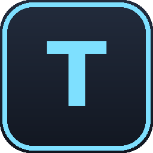
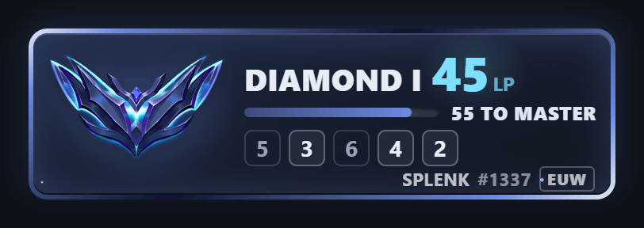
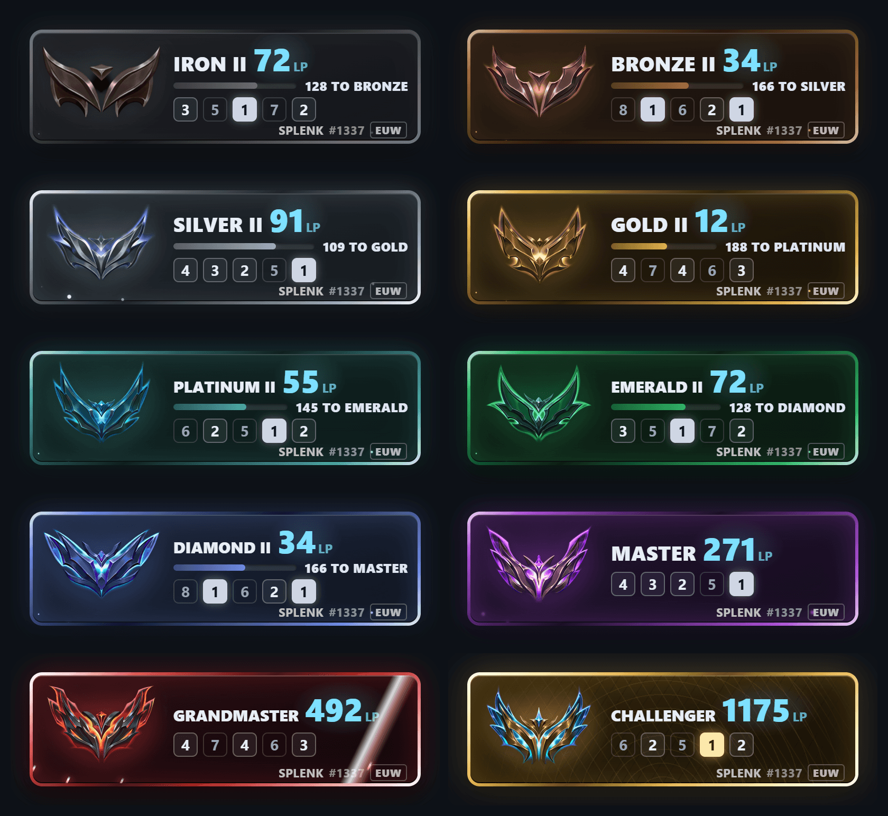
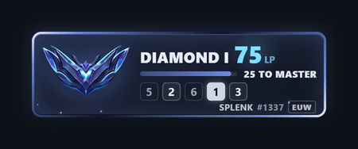
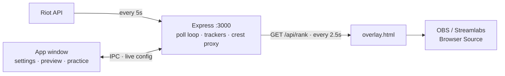

<div align="center">



# TFT Live Overlay

**Your Teamfight Tactics rank, LP swings and recent placements on stream — straight from the Riot API.**

[](LICENSE)
[](https://www.electronjs.org/)
[](#install)
[](#add-it-to-obs--streamlabs)



<sub>A won game landing. Captured from the real overlay — not a mockup.</sub>

### [⬇&nbsp; Download for Windows](https://github.com/TechNomadCode/TFT-Live-Overlay/releases/latest/download/tft-live-overlay-win-x64.exe)

<sub>[macOS · Apple Silicon](https://github.com/TechNomadCode/TFT-Live-Overlay/releases/latest/download/tft-live-overlay-mac-arm64.dmg) ·
[macOS · Intel](https://github.com/TechNomadCode/TFT-Live-Overlay/releases/latest/download/tft-live-overlay-mac-x64.dmg) ·
[Linux](https://github.com/TechNomadCode/TFT-Live-Overlay/releases/latest/download/tft-live-overlay-linux-x86_64.AppImage)</sub>

</div>

---

A desktop app that puts your live rank on your stream. It talks to Riot
directly, so there's no third-party service in the path adding its own rate
limit, its own outage, or another account to sign up for. Point it at your Riot
ID, add one Browser Source, done.

## Install

| | |
|---|---|
| **Windows** | [`tft-live-overlay-win-x64.exe`](https://github.com/TechNomadCode/TFT-Live-Overlay/releases/latest/download/tft-live-overlay-win-x64.exe) |
| **macOS** · Apple Silicon | [`tft-live-overlay-mac-arm64.dmg`](https://github.com/TechNomadCode/TFT-Live-Overlay/releases/latest/download/tft-live-overlay-mac-arm64.dmg) |
| **macOS** · Intel | [`tft-live-overlay-mac-x64.dmg`](https://github.com/TechNomadCode/TFT-Live-Overlay/releases/latest/download/tft-live-overlay-mac-x64.dmg) |
| **Linux** | [`tft-live-overlay-linux-x86_64.AppImage`](https://github.com/TechNomadCode/TFT-Live-Overlay/releases/latest/download/tft-live-overlay-linux-x86_64.AppImage) |

No Node, no clone, no build step. Settings live in your OS app-data folder rather
than next to the app, so installing a new version over the top keeps your Riot
ID, region and API key — and uninstalling leaves them alone.

<details>
<summary><b>Your OS says the app is unrecognised or can't be opened</b></summary>

The builds aren't code-signed — a Windows certificate is a paid yearly
subscription and macOS notarisation needs an Apple Developer account, neither of
which a free overlay app justifies. Nothing is wrong with the download; both
systems simply don't recognise the publisher.

| | |
|---|---|
| **Windows** | SmartScreen shows "Windows protected your PC" → **More info** → **Run anyway** |
| **macOS** | Right-click the app → **Open** → **Open**. Double-clicking gives you no Open button, only Cancel. If macOS insists it's damaged: `xattr -dr com.apple.quarantine "/Applications/TFT Live Overlay.app"` |
| **Linux** | The AppImage needs the executable bit: `chmod +x tft-live-overlay-linux-x86_64.AppImage` |

</details>

## Setup

1. **Account** → enter your Riot ID (name + tag, no `#`) and pick your region.
2. Paste a key from [developer.riotgames.com](https://developer.riotgames.com/).
   Personal keys expire every 24h — paste a fresh one in the same box when that
   happens, no restart needed.
3. **Save changes.** Takes effect immediately.

## Add it to OBS / Streamlabs

**Overlay** → **Copy URL** → add a **Browser Source** pointing at it
(`http://localhost:3000/overlay.html`).

The card is **370×108**. Set the source slightly larger — say 400×130. The page
background is transparent, so surplus source area is invisible, while a source
*smaller* than the card clips it.

The Overlay page previews the card as you configure it. That preview is the real
overlay in an iframe, not an approximation: what you see there is what OBS draws.

> **Want it bigger?** Add `?scale=1.5` to the URL. That re-renders the card at
> the larger size and stays sharp — unlike resizing the Browser Source, which
> stretches an already-rendered 370×108 texture.

> **Want it still?** `?motion=reduce` turns the animation off, `?motion=os`
> follows your machine's reduce-motion setting. Neither is the default — see
> [How it works](#how-it-works) for why. If the card is *unintentionally* frozen,
> **Help → Send a report**: the overlay measures itself inside whichever browser
> drew it and writes a plain-language verdict you can paste into an issue.

## What's on the card

| | |
|---|---|
| **Rank + LP** | Tier, division and LP. The figure rolls to its new value; a ▲/▼ marker shows the direction and fades. |
| **Progress bar** | LP to the next tier. Dropped at Master+, where promotion is population-gated rather than an LP target. |
| **Placement strip** | Last 5 finishes, newest first. Tonal, so it never competes with the LP readout. |
| **Rank moments** | A division change gets a 1s accent. A tier change gets the full takeover. |

Every tier gets its own material, not a hue rotation of one card: Grandmaster is
bladed crimson steel with a hard fast glint, Challenger is engraved gold with no
particles at all and a slow sheen that reveals the engraving.

<div align="center">



</div>

A tier change is the rarest thing that happens on a ranked stream and the most
worth clipping, so it gets the whole card for two and a half seconds — and the
card comes back in the colour of the tier you landed in. Frame, crest, particle
behaviour and colour ramp all swap under the flare, rather than snapping over
in one visible frame.

<div align="center">



<sub>Promotion into Master, then the demotion back out of it.</sub>

</div>

## How it works



Two poll loops at different rates, deliberately: server → Riot is
user-configurable and defaults to 5s, sized against a personal key's 100
requests/2min, while overlay → server is a fixed 2.5s because a localhost request
costs nothing. The window and the server are one process, so saving a new key or
region takes effect on the next poll instead of needing a restart.

A few decisions worth the detour:

- **Browser Source, not window capture.** Streamlabs renders a Browser Source
  off-screen in its own Chromium and composites it straight into the stream.
  Capturing a window instead adds a hop — GPU draws it, the OS compositor
  composites it, then OBS captures *that* — and alpha-transparent window capture
  is famously dependent on capture method and GPU driver. So the app is a GUI in
  front of a local HTTP server, not a window to point OBS at.

- **A poll is two awaited round-trips, so it can outlive its own config.**
  Saving a new Riot ID mid-flight let the old identity's 404 land afterwards and
  overwrite fresh state. Each poll captures an `identityEpoch` and drops its
  result if it no longer matches.

- **Error strings are UI copy, not diagnostics.** They render into a 222px-wide,
  10.5px footer band, on stream, in front of viewers. Riot answers failures with
  a JSON body, and interpolating that into the thrown error put
  `Riot API 401: {"status":{"message":"Forbid…` on the card, truncated
  mid-object. Status codes now map to short sentences; the raw body goes to the
  log.

- **Motion is gated on a URL flag, not `prefers-reduced-motion`.** It used to be
  the media query — and one OS checkbox (Windows' "Show animations", which every
  gaming perf guide tells you to turn off) silently deleted the sheen, the
  particles and every rank-change effect in every browser on that machine at
  once. It read as a broken build. The card is rendered for the *viewers*, so
  the operator's accessibility setting is the wrong signal.

- **The overlay can diagnose itself on a machine you don't have.** It measures
  whether the animation *clocks* are advancing (not whether a frame looks
  different — the sheen is idle 89% of its cycle, which makes pixel diffing
  useless), whether each stylesheet returned rules, the Chromium version and the
  GPU, then POSTs that to `/api/diag`. Anything matching a Riot key is scrubbed
  on the way in and out, because the whole point of the file is that people send
  it to strangers.

- **Rank crests are proxied and normalised, not hotlinked.** `GET /api/crest/:tier`
  fetches from Community Dragon and equalises every tier to the same visual area
  with `sharp`, so a plain `object-fit: contain` renders them at a consistent
  size.

## Development

No bundler, no TypeScript, no build step — what's in `src/` is what runs.

```bash
npm install
npm start
```

```
src/
├── shared/     tier + LP domain logic, loadable from Node and the browser alike
├── main/       Electron main process: lifecycle, tray, window, settings, IPC
├── preload/    the contextBridge surface (window.tftApp)
├── renderer/   the app window — Overlay, Account, Practice, Help
├── overlay/    overlay.html and its styles/scripts — what OBS loads
└── server/     Express + Riot polling, split into riot/, tracking/, crest/, routes/
```

Closing the window hides it to tray; the server stays up so OBS never loses
connection. Quit properly from the sidebar or the tray icon.

There's no automated test suite. The **Practice** page (`POST /api/test/event`)
drives mock rank and LP changes through the real code paths without spending API
quota — that's how every overlay state gets exercised. `src/server` has no
Electron dependency, so it also runs under plain Node:

```bash
node -e "require('./src/server').createOverlayServer({onStatusChange(){}}).start(3999)"
```

<details>
<summary><b>Building an installer, and cutting a release</b></summary>

`npm run build` runs `electron-builder` (configured in `package.json`) into
`dist/`. Build on the OS you're targeting — cross-compiling NSIS or dmg needs
tooling that isn't set up here, which is also why
[`.github/workflows/release.yml`](.github/workflows/release.yml) runs one job per
OS on GitHub's runners.

1. Bump `version` in `package.json` and commit.
2. Tag it as `v` + that exact version. `electron-builder` names the artifacts and
   the release from `package.json`, not from the tag, so a mismatch fails the
   workflow up front rather than shipping a `v1.0.1` tag full of `1.0.0` files.
   ```bash
   git tag v1.0.1 && git push origin v1.0.1
   ```
3. All three jobs upload into the same **draft** release. Nothing is downloadable
   until you publish it, so a failed Linux job can't leave a half-finished
   release in front of users.

No secrets to configure — `GITHUB_TOKEN` is provided automatically. Builds are
unsigned; `electron-builder` picks up `CSC_LINK` / `WIN_CSC_LINK` with no
workflow changes if you ever get certificates.

</details>

<details>
<summary><b>Regenerating the README's imagery</b></summary>

Every image above is a capture of the real Electron window driven through the
real server, not a hand-built mockup — a mockup drifts from the app immediately.

```bash
npx electron docs/_gif-build/capture.js   # frames + docs/overlay-tiers.png
node docs/_gif-build/encode.js            # the two GIFs
```

See [`docs/_gif-build/gif-capture.md`](docs/_gif-build/gif-capture.md) for the
multi-pass capture scheme and the gotchas it exists to work around.

</details>

<details>
<summary><b>About the npm warnings</b></summary>

**Deprecation warnings** (`inflight`, `glob@7.x`, `boolean@3.2.0`, `tar@6.2.1`)
all come from inside `electron-builder`'s dependency tree. They matter for
`npm run build`, never for `npm start`.

**`npm audit` reports 16 high severity** on a fresh install. That's one advisory
counted once per dependency path: a DoS in `brace-expansion`
([GHSA-mh99-v99m-4gvg](https://github.com/advisories/GHSA-mh99-v99m-4gvg)) where
a crafted glob can force unbounded expansion. Every path reaches it through
`electron-builder`, which is a devDependency; `build.files` is an explicit list,
so nothing from that chain ships in an installer; and the patterns it expands
come from this repo's own `package.json`, not from user input. Triggering it
would mean handing your own build tool a hostile pattern by hand.

It's deliberately not patched, because it currently can't be. The fix only exists
in `brace-expansion` 5.0.8+, and v5 changed its export from a callable function
to an object — every consumer in the chain still calls it as a function, so an
`overrides` entry forcing v5 breaks packaging outright. `npm audit fix --force`
suggests *downgrading* `electron-builder` a major version, which doesn't clear
the advisory either. This resolves itself when `electron-builder` updates its own
chain.

**If `npm start` says "Electron failed to install correctly":** recent npm
versions block dependency install scripts by default, and Electron's install
script is what downloads its binary. `package.json` pre-approves `electron` and
`electron-winstaller` via `allowScripts`, so a normal install shouldn't hit this.
If a future dependency does: `npm install-scripts approve <package>`, then
reinstall. `npm install-scripts ls` lists candidates.

</details>

## Notes

- Settings live in `app.getPath('userData')`, never in the project folder — it
  holds a Riot API key.
- The port is fixed at **3000** and the overlay path is fixed at
  `/overlay.html`, so a Browser Source configured once keeps working across
  updates.
- LP only moves once Riot finishes processing a match. Polling faster than a few
  seconds doesn't get you fresher data, it just spends quota.
- On Linux, `sharp` prints a startup warning about Electron binary
  compatibility. Known, harmless, works anyway. Windows and macOS don't show it.

## License

MIT — see [LICENSE](LICENSE).

<sub>TFT Live Overlay isn't endorsed by Riot Games and doesn't reflect the views
of Riot Games or anyone officially involved in producing or managing Riot Games
properties. Riot Games and all associated properties are trademarks or registered
trademarks of Riot Games, Inc.</sub>
