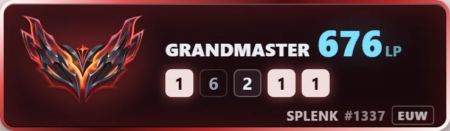

<div align="center">

# TFT Live Overlay

**Your Teamfight Tactics rank, LP swings and session record — live on stream,
straight from the Riot API.**

[](LICENSE)
[](https://www.electronjs.org/)
[](#download)
[](#adding-it-to-streamlabs--obs)
[](https://github.com/TechNomadCode/TFT-Live-Overlay/releases/latest)



<sub>The overlay card as it renders on stream, here at Grandmaster. The blade
sweep runs every 7s; the sheen and the drifting shards run on their own cycles,
so the loop seam is where they don't quite line back up.</sub>

</div>

---

A simple desktop app that shows your Teamfight Tactics rank, LP gain/loss,
session gains, and recent placement history on your Streamlabs or OBS stream
with low latency — it talks to the Riot API directly, so there's no
third-party service in the path adding its own rate limits.

## What's on the card

| | |
|---|---|
| **Rank + LP** | Current tier, division and LP. The LP figure rolls to its new value and a ▲/▼ marker shows the direction. |
| **Progress bar** | LP remaining to the next tier. Hidden at Master+, where promotion is population-gated rather than an LP target. |
| **Placement strip** | Your last 5 finishes, newest first — tonal, so it never competes with the LP readout. |
| **Tier colours** | The accent ramp, crest bloom and promotion banner all repaint to the tier you're actually in. |

## Download

**[⬇ Get the latest installer](https://github.com/TechNomadCode/TFT-Live-Overlay/releases/latest)**
— pick the file for your OS, double-click, done. No Node, no clone, no build.

| OS | File | Notes |
|---|---|---|
| **Windows** | `tft-live-overlay-<version>-win-x64.exe` | Windows SmartScreen shows "unrecognised app" — the installer isn't code-signed (a certificate is a paid, per-year thing). Click **More info** → **Run anyway**. |
| **macOS** | `tft-live-overlay-<version>-mac-arm64.dmg` (Apple Silicon) or `-mac-x64.dmg` (Intel) | Not notarised, so Gatekeeper blocks the first launch. Right-click the app → **Open** → **Open**, or run `xattr -dr com.apple.quarantine "/Applications/TFT Live Overlay.app"`. |
| **Linux** | the `.AppImage` | `chmod +x` it, then run it. |

Settings live in your OS app-data folder, so upgrading by installing over the
top keeps your Riot ID, region and API key.

## Running from source

Prefer to run it yourself, or want to hack on it:

```
npm install
npm start
```

**If `npm start` errors with "Electron failed to install correctly":**
Recent npm versions block dependency install scripts by default (a response
to a run of real supply-chain attacks on npm packages in late 2025/2026) —
Electron's install script is what downloads its actual binary, so if it
gets blocked, `node_modules/electron` ends up empty. This `package.json`
ships with `electron` and `electron-winstaller` (used when building a
Windows installer) pre-approved via the `allowScripts` field, so a normal
`npm install` shouldn't hit this. If it still does — e.g. a newer npm
changes the format, or a future dependency adds its own install script —
fix it the same way:
```
npm install-scripts approve <package-name>
npm install
```
Run `npm install-scripts ls` first if you're not sure which package needs it.

A window opens with three tabs: **Dashboard**, **Settings**, **Test**.
The app also adds a tray icon — closing the window just hides it; the
overlay server keeps running so Streamlabs/OBS never loses connection.
Quit fully from the tray icon's "Quit" option.

## First-time setup

1. Open **Settings**
2. Enter your Riot ID (name + tag, no `#`) and pick your region
3. Paste a Riot API key from [developer.riotgames.com](https://developer.riotgames.com/) — personal keys expire every 24h, just paste a fresh one in here when that happens, no restart needed
4. Click **Save Settings** — takes effect immediately

## Adding it to Streamlabs / OBS

Go to **Dashboard** → click **Copy URL** → add a **Browser Source** in
Streamlabs pointing to that URL (`http://localhost:3000/overlay.html`
by default).

The card itself is 370×108. Set the Browser Source slightly larger than
that (say 400×130) — the page background is transparent, so surplus
source area is invisible, while a source *smaller* than the card clips it.

> **Want it bigger?** Add `?scale=1.5` to the URL. That re-renders the card
> at the larger size, which stays sharp — unlike resizing the Browser Source
> in OBS, which stretches an already-rendered 370×108 texture and goes soft.
> Set the source to the scaled dimensions to match.

### Why Browser Source and not a captured window

I looked at wrapping the overlay itself in the Electron window and having
OBS/Streamlabs capture that window instead. It's worse on every axis:

- **Browser Source renders off-screen**, composited directly into the
  stream by Streamlabs' own lightweight Chromium instance — no visible
  window, no window manager, no extra compositing step.
- **Window capture adds a hop**: your GPU draws the window, the OS
  compositor (DWM on Windows) composites it, then OBS/Streamlabs has to
  capture *that* composited output — extra latency and a common source of
  stutter, especially with anything transparent.
- **Transparency is fragile with window capture** — getting a truly
  alpha-transparent capture working reliably (vs. a black or checkered
  background) depends on capture method and GPU driver, and breaks
  across setups. Browser Source transparency just works, always has.

So the app still runs the exact same local HTTP server approach — the
GUI is just for configuring and monitoring it instead of editing files
and env vars by hand.

## Trying it without playing a game

The **Test** tab drives the overlay through mock rank and LP changes
without spending any of your API key's quota — simulate a win, a loss, a
promotion, a demotion or an error and watch the card react. Use it to get
your Browser Source positioned and sized before you go live.

## Building a distributable installer

For a local build of the installer (`.exe` / `.dmg` / `.AppImage`):

```
npm run build
```

This uses `electron-builder`, configured in `package.json`, and outputs
to a `dist/` folder. Build on the OS you're targeting — cross-compiling
Windows installers from Mac/Linux (or vice versa) needs extra tooling
(Wine, etc.) that isn't set up here.

### Cutting a release

The installers on the [Releases page](https://github.com/TechNomadCode/TFT-Live-Overlay/releases)
are built by [`.github/workflows/release.yml`](.github/workflows/release.yml),
which runs one job per OS — the same "build on the target OS" constraint,
just on GitHub's runners instead of three machines of your own.

1. Bump `version` in `package.json` and commit it.
2. Tag it and push: the tag has to be `v` + that exact version, because
   `electron-builder` names both the artifacts and the release from
   `package.json`, not from the tag. A mismatch fails the workflow up front
   rather than producing a `v1.0.1` tag holding `1.0.0` files.
   ```
   git tag v1.0.1
   git push origin v1.0.1
   ```
3. All three jobs upload into the same **draft** release. Once they're green,
   write the notes and hit **Publish release** — nothing is downloadable
   until you do, so a failed Linux job can't leave a half-finished release
   sitting in front of users.

No secrets to configure: `GITHUB_TOKEN` is provided to the workflow
automatically. Builds are unsigned — signing needs a paid Windows
certificate and an Apple Developer account, which is what the SmartScreen
and Gatekeeper warnings in [Download](#download) are about. If you ever get
certs, `electron-builder` picks them up from `CSC_LINK` / `WIN_CSC_LINK`
secrets with no workflow changes beyond passing them through.

## About the npm warnings

**Deprecated package warnings** (`inflight`, `glob@7.x`, `boolean@3.2.0`, `tar@6.2.1`)
all come from inside `electron-builder`'s own dependency tree — not
anything this project imports directly. They only matter for `npm run
build` (packaging an installer), never for `npm start`.

**Vulnerabilities**: `npm audit` reports **16 high severity** on a fresh
install. That number is misleading — it's one advisory counted once per
dependency path.

All 16 resolve to a single DoS in `brace-expansion`
([GHSA-mh99-v99m-4gvg](https://github.com/advisories/GHSA-mh99-v99m-4gvg),
CVSS 7.5), where a crafted glob pattern can force unbounded expansion and
exhaust memory. Every path reaches it through `electron-builder`
(`@electron/asar` → `glob` → `minimatch` → `brace-expansion`, and
variations on that chain).

It doesn't affect the app or anyone running it:

- `electron-builder` is a **devDependency**. It runs only for
  `npm run build` when packaging an installer — `npm start` never loads it.
- The `build.files` list is explicit, so only this project's own source is
  packaged. Nothing from the vulnerable chain ships to an installed app.
- The glob patterns it expands come from this repo's own `package.json`,
  not from user input or any network source. Triggering the DoS would mean
  feeding your own build tool a hostile pattern by hand.

**It's deliberately not patched**, because it currently can't be without
breaking the build. The fix only exists in `brace-expansion` 5.0.8+, and v5
changed its export from a callable function to an object (`{ expand }`).
Every consumer in the chain still calls it as a function — see
`minimatch.js`, `var expand = require('brace-expansion')` then
`expand(pattern)` — so an `overrides` entry forcing v5 breaks packaging
outright. `npm audit fix --force` is no better: its suggestion is to
*downgrade* `electron-builder` 26.15.3 → 25.1.8, which is a major version
backwards and doesn't clear the advisory either.

This clears itself when `electron-builder` updates its own dependency
chain. Worth re-checking with `npm audit` now and then; there's nothing to
act on in the meantime.

**Earlier audit history**: an initial pass cleared 9 findings (8 high, 1
critical) by bumping `electron-builder` `24.13.3 → ^26.0.0` and `electron`
`30.0.0 → ^43.0.0`. The Electron CVE (ASAR integrity bypass, plus an
AppleScript injection issue on macOS) only applied to apps using specific
opt-in hardening flags or `app.moveToApplicationsFolder()` — neither of
which this app does — but it was closed outright rather than argued.


## Project layout

No bundler and no build step — what's in `src/` is what runs.

```
src/
├── shared/     tier + LP domain logic, loadable from Node and the browser alike
├── main/       Electron main process: lifecycle, tray, window, settings, IPC
├── preload/    the contextBridge surface (window.tftApp)
├── renderer/   the settings/dashboard window
├── overlay/    overlay.html and its styles/scripts — what OBS loads
└── server/     Express + Riot polling, split into riot/, tracking/, crest/, routes/
```

## Notes

- Settings are stored in your OS's app-data folder (`app.getPath('userData')`),
  not in the project folder — safe to move/reinstall the app without losing config.
- The overlay port is fixed at `3000` so an existing Streamlabs Browser
  Source keeps working across updates without reconfiguring.
- On Linux, `sharp` (used to auto-trim rank crest images) prints a startup
  warning about Electron binary compatibility — this is a known, generally
  harmless notice; it was tested working correctly during development.
  Windows/Mac don't show this warning.
- LP only updates once Riot finishes processing a completed match — polling
  faster than a few seconds doesn't get you fresher data sooner. The default
  is 5s, which stays comfortably within a personal key's rate limit
  (100 requests/2min); go higher in Settings if you'd rather be extra
  conservative with your key's quota.

## License

MIT — see [LICENSE](LICENSE).

## Disclaimer

TFT Live Overlay isn't endorsed by Riot Games and doesn't reflect the views or
opinions of Riot Games or anyone officially involved in producing or managing
Riot Games properties. Riot Games and all associated properties are trademarks
or registered trademarks of Riot Games, Inc.
